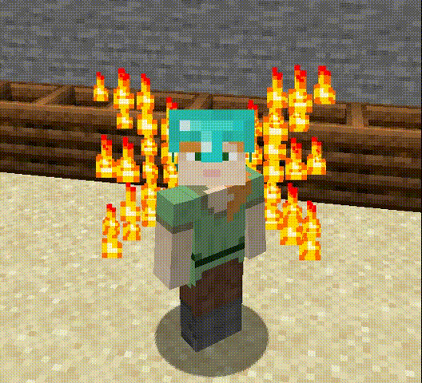

# 装备特效

## 展示




## 实现方法

在`plugins/NeigeItems/ItemActions`中配置物品动作

用MM技能实现:

```yaml
特效头盔:
  tick_head:
    # 10tick触发一次
    tick: 10
    actions:
    - "castSkill: SkillTest"
```

用JS实现:

```yaml
特效头盔:
  tick_head:
    # 4tick触发一次
    tick: 4
    actions:
    - |-
      js: 
        var a = [
        [1, 1, 1, 0, 0, 0, 0, 0, 1, 1, 1],
        [0, 1, 1, 1, 0, 0, 0, 1, 1, 1, 0],
        [0, 0, 1, 1, 1, 0, 1, 1, 1, 0, 0],
        [1, 1, 1, 1, 1, 0, 1, 1, 1, 1, 1],
        [0, 0, 1, 1, 1, 0, 1, 1, 1, 0, 0],
        [0, 1, 1, 1, 0, 0, 0, 0, 1, 1, 0],
        [1, 1, 0, 0, 0, 0, 0, 0, 0, 1, 1],
        [1, 0, 0, 0, 0, 0, 0, 0, 0, 0, 1]];

        (function onEffectTick(entity){
          var Particle = Java.type("org.bukkit.Particle");
          for (var i = a.length - 1; i >= 0; i--) {
            for (var j = a[i].length - 1; j >= 0; j--) {
              if (a[i][j] != 0) {
                draw(entity.getLocation(), entity.getLocation().add(-a[i].length * 1.0 / 10 + j * 1.0 / 5 + 0.1, 0.2, 0), 1.8 - i * 1.0 / 5 + 0.2, Particle.FLAME, 20);
              }
            }
          }
        })(player)

        function draw(PlayerLocation, EffectLocation, g, pe, addAngle) {
          var Particle = Java.type("org.bukkit.Particle");
          var Ploc = PlayerLocation.clone();
          var Eloc = EffectLocation.clone();
          var jdc = getAngle(Ploc.getX(), Ploc.getY(), Eloc.getX(), Eloc.getY());
          if (jdc < 90) {
            jdc += addAngle;
          } else {
            jdc -= addAngle;
          }
          var jl = getDistance(Ploc.getX(), Ploc.getY(), Eloc.getX(), Eloc.getY());
          var radians = toRadians(jdc + Ploc.getYaw() - 180);
          var x = Math.cos(radians) * jl;
          var y = Math.sin(radians) * jl;
          Ploc.add(x, g, y);
          Ploc.getWorld().spawnParticle(pe, Ploc, 0);
          Ploc.subtract(x, g, y);
        }

        function toRadians(angdeg) {
          return angdeg / 180.0 * Math.PI;
        }

        function getDistance(x1, y1, x2, y2) {
          var x = Math.abs(x2 - x1);
          var y = Math.abs(y2 - y1);
          return Math.sqrt(x * x + y * y);
        }

        function getAngle(x1, y1, x2, y2) {
          var x = x2 - x1;
          var y = y2 - y1;
          var hypotenuse = Math.sqrt(Math.pow(x, 2) + Math.pow(y, 2));
          var cos = x / hypotenuse;
          var radian = Math.acos(cos);
          var angle = 180 / (Math.PI / radian);
          if (y < 0) {
            angle = -angle;
          } else if ((y == 0) && (x < 0)) {
            angle = 180;
          }
          return angle;
        }
```
