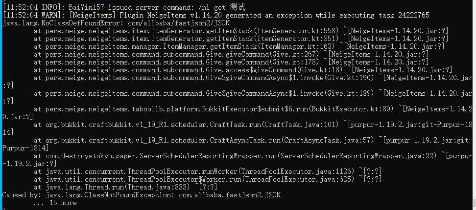

## 需求

1.12.2-1.20.1 bukkit服务端

已测试：
* paper1.12.2-1.20.1
* arclight1.16.5
* spigot1.12.2
* catserver1.12.2

## 安装NeigeItems

[NeigeItems-Release](https://github.com/Neige7/NeigeItems-Kotlin/releases)

1. 点击上方链接，通过GitHub下载NeigeItems插件(一般选择`NeigeItems-版本.jar`, 如`NeigeItems-1.15.1.jar`)
2. 将文件丢入plugins文件夹
3. 重启服务器

## 注意

不要使用后缀为-api的版本(如`NeigeItems-1.15.1-api.jar`), 该版本用于写附属时引作依赖

如果进入服务器后生成物品时后台报错`NoClassDefFoundError`, 说明你服务器网不好, 没有成功下载依赖

此时你应使用Github上后缀为-all的版本(如`NeigeItems-1.15.1-all.jar`), 这个版本将依赖打包进了插件本体

最新版本以Github为准, MCBBS上的版本可能有些许滞后

报错示例：

:::caution

不要尝试通过Plugman等热重载工具加载NeigeItems

:::
