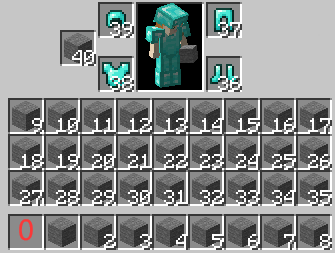
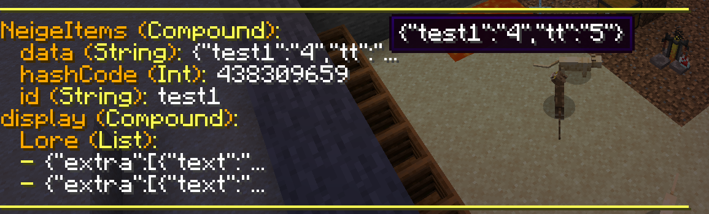

# PlaceholderAPI

## 即时声明节点解析

`%ni_parse_内容%`

例：`%ni_parse_<number::0_1_5>%` 返回0-1保留5位小数的随机数，如0.45784

## 物品节点检测

`%ni_data_检测类型_检测槽位_参数%`

* `检测类型`

    * `get` 获取对应节点的值

    * `has` 检测是否存在这个节点

    * `check` 检测这个节点的值是否完全匹配某段字符串

    * `eval` 对相关内容进行一番操作, 并获取返回值

* `检测槽位`

    * `hand` 玩家主手物品

    * `offhand` 玩家副手物品

    * `head` 玩家头部物品

    * `chest` 玩家胸部物品

    * `legs` 玩家腿部物品

    * `feet` 玩家脚部物品

    * `数字(如0、1、2...)` 背包内对应位置的物品, 槽位对应如图所示

    

* `参数` 不同的检测类型对应不同的参数类型

    * `get` 待获取节点的key

        请看示例物品:

        

        可以看到示例物品的`test1`节点的值为`4`, 我手持物品时, `%ni_data_get_hand_test1%`的返回值即为`4`

        示例物品不存在`test2`节点, 我手持物品时, `%ni_data_get_hand_test2%`将返回一个空字符串

    * `has` 待检测节点的key

        请看示例物品:

        

        可以看到示例物品存在`test1`节点, 我手持物品时, `%ni_data_has_hand_test1%`的返回值即为`true`

        示例物品不存在`test2`节点, 我手持物品时, `%ni_data_has_hand_test2%`的返回值即为`false`

    * `check` 一段json文本, 用于进行键值比较

        请看示例物品:

        

        可以看到示例物品的`test1`节点的值为`4`, 因此, 我手持物品时, `%ni_data_check_hand_{"test1":"4"}%`的返回值为`true`, `%ni_data_check_hand_{"test1":"5"}%`的返回值为`false`(不匹配)

        示例物品不存在`test2`节点, 我手持物品时, `%ni_data_check_hand_{"test2":"4"}%`的返回值为`false`(不匹配)

    * `eval` 一段javascript代码, 用于进行内容处理

        data检测的eval类型中将内置以下顶级变量:

        * `player` 类型`Player`, 代表物品拥有者

        * `itemStack` 类型`ItemStack`, 代表物品本身

        * `id` 类型`String`, 代表物品的PoemSuits物品ID

        * `itemTag` 类型`NbtCompound`, 代表物品的NBT

        * `data` 类型`HashMap<String, String>`, 代表物品的节点信息

        使用eval类型需要一定的javascript基础, 以下是示例物品与简单例子:

        

        `%ni_data_eval_hand_data.test1 > 3 && data.test1 < 5%`检测test1节点的值大于3且小于5, 对于示例物品, 结果返回`true`

        `%ni_data_eval_hand_id.contains("test")%`检测物品的PoemSuits物品ID是否包含`test`这段字符, 对于示例物品, 结果返回`true`

## 物品NBT检测

`%ni_nbt_检测类型_检测槽位_参数%`

* `检测类型`

    * `get` 获取对应NBT的值

    * `has` 检测是否存在这个NBT

    * `check` 检测这个NBT的值是否完全匹配某段字符串

    * `eval` 对相关内容进行一番操作, 并获取返回值

* `检测槽位`

    * `hand` 玩家主手物品

    * `offhand` 玩家副手物品

    * `head` 玩家头部物品

    * `chest` 玩家胸部物品

    * `legs` 玩家腿部物品

    * `feet` 玩家脚部物品

    * `数字(如0、1、2...)` 背包内对应位置的物品, 槽位对应如图所示

    

* `参数` 不同的检测类型对应不同的参数类型

    * `get` 待获取NBT的key

        请看示例物品:

        

        可以看到示例物品的`PoemSuits.id`NBT的值为`test1`, 我手持物品时, `%ni_nbt_get_hand_PoemSuits.id%`的返回值即为`test1`

        示例物品不存在`test`这条NBT, 我手持物品时, `%ni_nbt_get_hand_test%`将返回一个空字符串

    * `has` 待检测NBT的key

        请看示例物品:

        

        可以看到示例物品存在`PoemSuits.id`这条NBT, 我手持物品时, `%ni_nbt_has_hand_PoemSuits.id%`的返回值即为`true`

        示例物品不存在`test`这条NBT, 我手持物品时, `%ni_nbt_has_hand_test%`的返回值即为`false`

    * `check` 一段json文本, 用于进行键值比较

        请看示例物品:

        

        可以看到示例物品的`PoemSuits.id`NBT的值为`test1`, 因此, 我手持物品时, `%ni_nbt_check_hand_{"PoemSuits.id":"test1"}%`的返回值为`true`, `%ni_nbt_check_hand_{"PoemSuits.id":"test2"}%`的返回值为`false`(不匹配)

        示例物品不存在`test`这条NBT, 我手持物品时, `%ni_nbt_check_hand_{"test":"4"}%`的返回值为`false`(不匹配)

    * `eval` 一段javascript代码, 用于进行内容处理

        nbt检测的eval类型中将内置以下顶级变量:

        * `player` 类型`Player`, 代表物品拥有者

        * `itemStack` 类型`ItemStack`, 代表物品本身

        * `itemTag` 类型`NbtCompound`, 代表物品的NBT

        使用eval类型需要一定的javascript基础, 以下是示例物品与简单例子:

        

        `%ni_nbt_eval_hand_itemTag.getAsString()%`将返回字符串化的物品NBT, 对于示例物品, 结果返回`{PoemSuits:{id:"test1",hashCode:438309659,data:'{"test1":"4","tt":"5"}'},display:{Lore:['{"extra":[{"text":"4"}],"text":""}','{"extra":[{"text":"Neige"}],"text":""}']}}`
