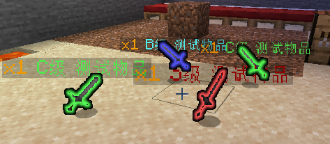

# 额外选项

以默认配置为例:

```yaml
ExampleItem4:
  material: STONE
  lore:
  - '物品使用次数: %neigeitems_charge%/%neigeitems_maxCharge%'
  options:
    charge: 10
```

`options`下的所有配置项, 即为"额外选项"

## 使用次数

```yaml
test:
  material: STONE
  options:
    charge: 10
```

`charge` 该物品可使用的次数 (与可触发物品动作的次数有关, 不是原版的物品耐久)

关于该选项在Name和Lore中的显示, 请查看[物品变量](物品/物品变量.md)

## 最大使用次数

```yaml
test:
  material: STONE
  options:
    charge: 5
    maxcharge: 10
```

`maxcharge` 该物品最大可使用的次数 (与可触发物品动作的次数有关, 不是原版的物品耐久)

不填写`maxcharge`仅填写`charge`的情况下, `maxcharge`默认等于`charge`

关于该选项在Name和Lore中的显示, 请查看[物品变量](物品/物品变量.md)

## 自定义耐久

```yaml
test:
  material: STONE_SWORD
  options:
    durability: 10
```

`durability` 该物品自定义耐久

关于该选项在Name和Lore中的显示, 请查看[物品变量](物品/物品变量.md)

## 最大自定义耐久

```yaml
test:
  material: STONE_SWORD
  options:
    durability: 5
    maxdurability: 10
```

`maxdurability` 该物品最大自定义耐久

不填写`maxdurability`仅填写`durability`的情况下, `maxdurability`默认等于`durability`

关于该选项在Name和Lore中的显示, 请查看[物品变量](物品/物品变量.md)

## 自定义耐久耗尽后是否损坏

```yaml
test:
  material: STONE_SWORD
  options:
    durability: 5
    maxdurability: 10
    itembreak: false
```

`itembreak` 自定义耐久耗尽后是否损坏

关于该选项在Name和Lore中的显示, 请查看[物品变量](物品/物品变量.md)

## 物品光效

```yaml
ExampleItem:
  material: STONE
  options:
    color: GOLD
```



此选项可以使掉落物产生发光效果

可用颜色有：

* AQUA
* BLACK
* BLUE
* DARK_AQUA
* DARK_BLUE
* DARK_GRAY
* DARK_GREEN
* DARK_PURPLE
* DARK_RED
* GOLD
* GRAY
* GREEN
* LIGHT_PURPLE
* RED
* WHITE
* YELLOW

## 掉落技能

```yaml
ExampleItem:
  material: STONE
  options:
    dropskill: SkillTest
```


如图所示，此选项可使物品在掉落时触发MM技能。

只有通过`/ni drop`指令，以及通过击杀MM怪物掉落的NI物品才会触发，玩家主动丢弃不会。

作者并没有图中所示技能的版权，因此不在这里具体写出该技能。

## 掉落物归属

以默认配置为例

```yaml
ownerTest:
  material: STONE
  name: 你捡我啊
  options:
    owner: Neige
```

上述物品通过`/ni drop`或击杀MM怪物掉落该物品, 该物品首次拾取只能由`Neige`完成

你可以将`owner`填写为`"%player_name%"`, 这样就是谁击杀就属于谁了

首次拾取后将不再有掉落物归属效果

服务器重启后效果重置 (掉了, 关服了, 再次开服, 谁都能捡)

:::tip

通过/ni get或/ni give直接获取拥有掉落物归属的物品

物品将包含特殊NBT (用于记录归属人)

但通过/ni drop或击杀MM怪物掉落的物品将不包含该nbt (掉落的时候移除了)

你可以启用config中的`ItemOwner.removeNBTWhenGive`选项, 在/ni get或/ni give时移除相关NBT

:::

## 物品时限

```yaml
物品ID:
  material: STONE
  options:
    itemtime: 物品时限(单位是秒)
```

以默认配置为例

```yaml
itemTimeTest:
  material: STONE
  name: 限时物品-到期时间-<js::ItemTime.js::main_<itemtime>>
  options:
    itemtime: <itemtime>
  sections:
    itemtime: 60
```

搭配默认脚本

```js
function main(time) {
    const date = new Date()
    date.setTime(date.getTime() + (Number(time) * 1000))
    return date.getFullYear() + "年" + (date.getMonth() + 1) + "月" + date.getDate() + "日" + date.getHours() + "时" + date.getMinutes() + "分" + date.getSeconds() + "秒"
}
```

可以生成形如`限时物品-到期时间-2022年8月11日21时59分5秒` 的物品，物品到期即自动删除并提示信息。

如默认配置所示，你可以在对应位置放置一个节点，然后通过指向数据给予物品时自定义时长。

例如: `/ni give Neige itemTimeTest 1 true {"itemtime":"120"}`将给予玩家一个剩余时间120秒的默认物品

## 物品更新

```yaml
物品ID:
  material: STONE
  options:
    update:
      enable: true
      protect:
      - Enchantments
      - PublicBukkitValues
```

将`update.enable`设置为true即开启物品更新

`update.protect`下的所有NBT都不会被更新, 你可以通过手持物品执行`/ni itemnbt`指令查看物品NBT, 方便了解自己需要填写什么

对于多级NBT, 可以通过`.`分隔, 比如:

```yaml
ItemsAdder:
  id: test
  xxx: xxx
```

你只希望保留`id`而不希望保留`xxx`, 则可以填写`ItemsAdder.id`

如果某个键中包含`.`, 比如:

```yaml
test:
  test: 123
test.test:
  test: 123
```

你希望保留第二条NBT, 则应该填写`test\.test`, 即通过反斜杠转义, 在配置中体现为:

```yaml
物品ID:
  material: STONE
  options:
    update:
      enable: true
      protect:
      - test\.test
```

或

```yaml
物品ID:
  material: STONE
  options:
    update:
      enable: true
      protect:
      - "test\\.test"
```

注意反斜杠应该以文本的形式出现, yaml语法中双引号包裹的反斜杠是转义符, 单引号包裹或无包裹的反斜杠是文本, 双引号包裹的情况下可以用双反斜杠表示文本形式的反斜杠
